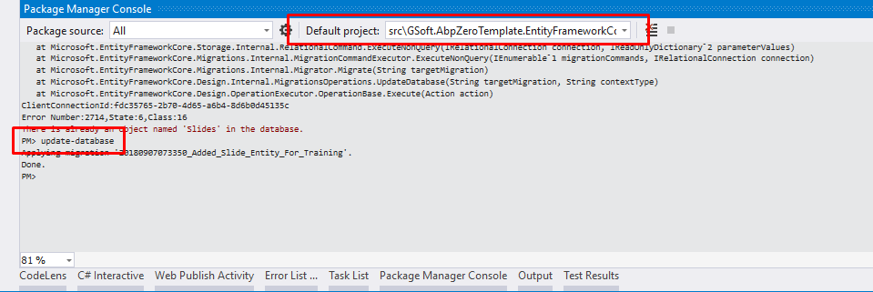
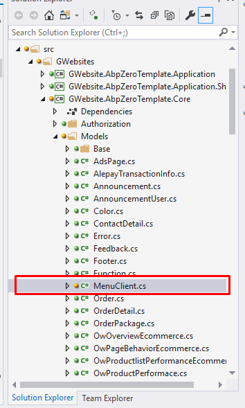
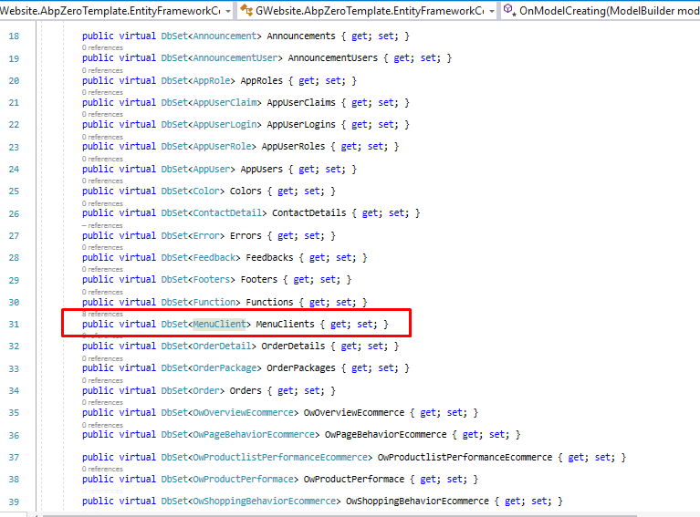
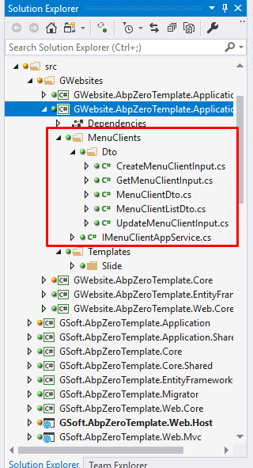
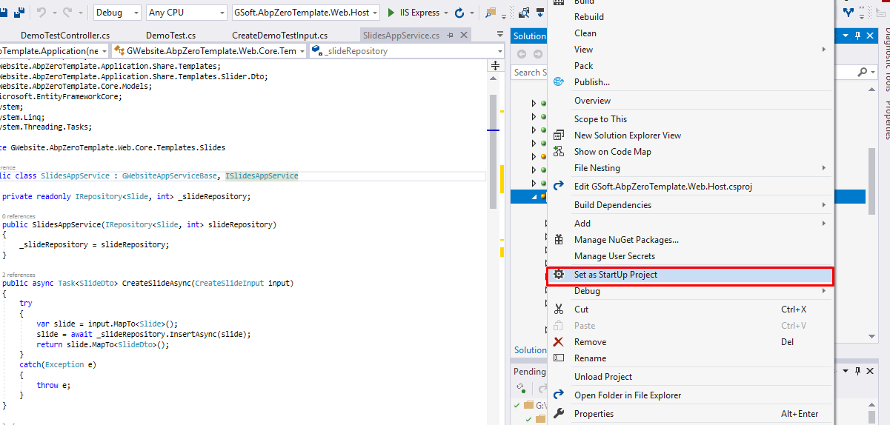
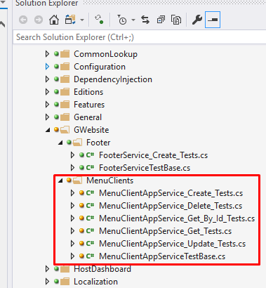

`## Hướng dẫn cấu hình code
1. Chỉnh connection string sql
    - Mở apppsetting.json trong project GSoft.AbpZeroTemplate.Web.Host 
    ```JSON
     "ConnectionStrings": {
        "Default": "Server=<server-name>; Database=<database-name>; Trusted_Connection=True;"
    }
    ```
    - Mở apppsetting.json trong project GSoft.AbpZeroTemplate.Web.Mvc 
    ```JSON
     "ConnectionStrings": {
        "Default": "Server=<server-name>; Database=<database-name>; Trusted_Connection=True;"
    }
    ```
    - Vào Menu View -> Other Window -> Package Manager Console
    - Trong Package Manager Console Phần Default Project chọn GSoft.AbpZeroTemplate.EntityFrameworkCore
    - Run command line (Nhấn enter)
    ```CMD
    Update-Database
    ```
    
## Hướng dẫn tạo 1 Entity (Table database)
1. Tạo 1 Entity
    - Vào project GWebsite.AbpZeroTemplate.Core tạo 1 class là tên của Entity trong ví dụ này là DemoTest
     
    ```C#
    
    using Abp.Domain.Entities;
    using System;

    namespace GWebsite.AbpZeroTemplate.Core.Models
    {
        public partial class MenuClient : Entity<int>
        {
            public string Name { get; set; }
            public string Alias { get; set; }
            public string Description { get; set; }
            public int? ParentId { get; set; }
            public int? DisplayOrder { get; set; }
            public int? HomeOrder { get; set; }
            public string Image { get; set; }
            public bool? HomeFlag { get; set; }
            public DateTime? CreatedDate { get; set; }
            public string CreatedBy { get; set; }
            public DateTime? UpdatedDate { get; set; }
            public string UpdatedBy { get; set; }
            public string MetaKeyword { get; set; }
            public string MetaDescription { get; set; }
            public bool Status { get; set; }
        }
    }


    ```
2. Vào project GWebsite.AbpZeroTemplate.EntityFrameworkCore mở file GWebsiteDbContext.cs thêm đoạn code sau
     
     ```C#
    public virtual DbSet<MenuClient> MenuClients { get; set; }
    ```
3. Vào Package Manager Console  
    Phần Default Project chọn GSoft.AbpZeroTemplate.EntityFrameworkCore
    - Run command line
    ```CMD
    Add-Migration <migration-name>
    ```
    - Run command line
    ```CMD
    Update-Database
    ```
    
## Hướng dẫn tạo AppService (Code nghiệp vụ)
1.  Vào project GWebsite.AbpZeroTemplate.Application.Share tạo 1 thư mục là tên của entity + s/es
     
    -   Code các file như sau
    -   CreateMenuClientInput.cs
    ```C#
    using System;
    using System.ComponentModel.DataAnnotations;

    namespace GWebsite.AbpZeroTemplate.Application.Share.MenuClients.Dto
    {
        public class CreateMenuClientInput
        {
            [Required]
            public string Name { get; set; }
            public string Alias { get; set; }
            public string Description { get; set; }
            public int? ParentId { get; set; }
            public int? DisplayOrder { get; set; }
            public int? HomeOrder { get; set; }
            public string Image { get; set; }
            public bool? HomeFlag { get; set; }
            public string MetaKeyword { get; set; }
            public string MetaDescription { get; set; }
            public bool Status { get; set; }
        }
    }
    ```
       - GetMenuClientInput.cs
    ```C#
    using Abp.Runtime.Validation;
    using GSoft.AbpZeroTemplate.Dto;
    using System;
    using System.ComponentModel.DataAnnotations;

    namespace GWebsite.AbpZeroTemplate.Application.Share.MenuClients.Dto
    {
        public class GetMenuClientInput : PagedAndSortedInputDto, IShouldNormalize
        {
            [Range(1, int.MaxValue)]
            public int Id { get; set; }

            public string Name { get; set; }

            public void Normalize()
            {
                if (string.IsNullOrEmpty(Sorting))
                {
                    Sorting = "user.Name, user.Surname";
                }
                else if (Sorting.Contains("name"))
                {
                    Sorting = Sorting.Replace("userName", "user.userName");
                }
                else if (Sorting.Contains("addedTime"))
                {
                    Sorting = Sorting.Replace("addedTime", "uou.creationTime");
                }
            }
        }
    }

    ```
       - MenuClientDto.cs
    ```C#
    using System;

    namespace GWebsite.AbpZeroTemplate.Application.Share.MenuClients.Dto
    {
        public class MenuClientDto
        {
            public string Name { get; set; }
            public string Alias { get; set; }
            public string Description { get; set; }
            public int? ParentId { get; set; }
            public int? DisplayOrder { get; set; }
            public int? HomeOrder { get; set; }
            public string Image { get; set; }
            public bool? HomeFlag { get; set; }
            public string MetaKeyword { get; set; }
            public string MetaDescription { get; set; }
            public bool Status { get; set; }
        }
    }

    ```
       - MenuClientListDto.cs
    ```C#
    using System;

    namespace GWebsite.AbpZeroTemplate.Application.Share.MenuClients.Dto
    {
        public class MenuClientListDto
        {
            public string Name { get; set; }
            public string Alias { get; set; }
            public string Description { get; set; }
            public int? ParentId { get; set; }
            public int? DisplayOrder { get; set; }
            public int? HomeOrder { get; set; }
            public string Image { get; set; }
            public bool? HomeFlag { get; set; }
            public bool Status { get; set; }
        }
    }
    ```
       - UpdateMenuClientInput.cs
    ```C#
    using System;
    using System.ComponentModel.DataAnnotations;

    namespace GWebsite.AbpZeroTemplate.Application.Share.MenuClients.Dto
    {
        public class UpdateMenuClientInput
        {
            [Range(1, int.MaxValue)]
            public int Id { get; set; }
            [Required]
            public string Name { get; set; }
            public string Alias { get; set; }
            public string Description { get; set; }
            public int? ParentId { get; set; }
            public int? DisplayOrder { get; set; }
            public int? HomeOrder { get; set; }
            public string Image { get; set; }
            public bool? HomeFlag { get; set; }
            public string MetaKeyword { get; set; }
            public string MetaDescription { get; set; }
            public bool Status { get; set; }
        }
    }
    ```
       - IMenuClientAppService.cs
    ```C#
    using Abp.Application.Services.Dto;
    using GWebsite.AbpZeroTemplate.Application.Share.MenuClients.Dto;
    using System.Threading.Tasks;
    using System;

    namespace GWebsite.AbpZeroTemplate.Application.Share.MenuClients
    {
        public interface IMenuClientAppService
        {
            Task<ListResultDto<MenuClientDto>> GetMenuClientsAsync();

            Task<PagedResultDto<MenuClientListDto>> GetMenuClientsAsync(GetMenuClientInput input);

            Task<MenuClientDto> GetMenuClientByIdAsync(EntityDto<int> input);

            Task<MenuClientDto> CreateMenuClientAsync(CreateMenuClientInput input);

            Task<MenuClientDto> UpdateMenuClientAsync(UpdateMenuClientInput input);

            Task DeleteMenuClientAsync(EntityDto<int> input);
        }
    }

    ```
2.  Vào project GWebsite.AbpZeroTemplate.Application tạo file MenuClientAppService.cs
  - Xem phần hướng dẫn phân quyền **[SetPermission.md](SetPermission.md)** phần Define permission trong docs trước khi làm ví dụ này

    ```C#
    using Abp.Application.Services.Dto;
    using Abp.Authorization;
    using Abp.AutoMapper;
    using Abp.Domain.Repositories;
    using Abp.Extensions;
    using Abp.Linq.Extensions;
    using GWebsite.AbpZeroTemplate.Application.Share.MenuClients;
    using GWebsite.AbpZeroTemplate.Application.Share.MenuClients.Dto;
    using GWebsite.AbpZeroTemplate.Core.Authorization;
    using GWebsite.AbpZeroTemplate.Core.Models;
    using Microsoft.EntityFrameworkCore;
    using System.Linq;
    using System.Linq.Dynamic.Core;
    using System.Threading.Tasks;

    namespace GWebsite.AbpZeroTemplate.Application.MenuClients
    {
        [AbpAuthorize(GWebsitePermissions.Pages_Administration_MenuClient)]
        public class MenuClientAppService : GWebsiteAppServiceBase, IMenuClientAppService
        {
            private readonly IRepository<MenuClient, int> _menuRepository;

            public MenuClientAppService(IRepository<MenuClient, int> menuRepository)
            {
                _menuRepository = menuRepository;
            }

            public async Task<ListResultDto<MenuClientDto>> GetMenuClientsAsync()
            {
                var items = await _menuRepository.GetAllListAsync();

                return new ListResultDto<MenuClientDto>(
                    items.Select(item => ObjectMapper.Map<MenuClientDto>(item)).ToList());
            }

            public async Task<PagedResultDto<MenuClientListDto>> GetMenuClientsAsync(GetMenuClientInput input)
            {
                var query = _menuRepository.GetAll()
                    .WhereIf(!input.Name.IsNullOrWhiteSpace(), m => m.Name.Contains(input.Name));

                var totalCount = await query.CountAsync();
                var items = await query.OrderBy(input.Sorting).PageBy(input).ToListAsync();

                return new PagedResultDto<MenuClientListDto>(
                    totalCount,
                    items.Select(item => ObjectMapper.Map<MenuClientListDto>(item)).ToList());
            }

            public async Task<MenuClientDto> GetMenuClientByIdAsync(EntityDto<int> input)
            {
                var entity = await _menuRepository.GetAsync(input.Id);
                return ObjectMapper.Map<MenuClientDto>(entity);
            }

            [AbpAuthorize(GWebsitePermissions.Pages_Administration_MenuClient_Create)]
            public async Task<MenuClientDto> CreateMenuClientAsync(CreateMenuClientInput input)
            {
                var entity = ObjectMapper.Map<MenuClient>(input);
                entity = await _menuRepository.InsertAsync(entity);
                await CurrentUnitOfWork.SaveChangesAsync();
                return ObjectMapper.Map<MenuClientDto>(entity);
            }

            [AbpAuthorize(GWebsitePermissions.Pages_Administration_MenuClient_Edit)]
            public async Task<MenuClientDto> UpdateMenuClientAsync(UpdateMenuClientInput input)
            {
                var entity = await _menuRepository.GetAsync(input.Id);
                ObjectMapper.Map(input, entity); 
                entity = await _menuRepository.UpdateAsync(entity);
                await CurrentUnitOfWork.SaveChangesAsync();
                return ObjectMapper.Map<MenuClientDto>(entity);
            }

            [AbpAuthorize(GWebsitePermissions.Pages_Administration_MenuClient_Delete)]
            public async Task DeleteMenuClientAsync(EntityDto<int> input)
            {
                var entity = await _menuRepository.GetAsync(input.Id);
                entity.Status = false;
                entity = await _menuRepository.UpdateAsync(entity);
                await CurrentUnitOfWork.SaveChangesAsync();
            }
        }
    }
    ```
3.  Vào GWebsite.AbpZeroTemplate.Application chọn file CustomDtoMapper.cs thêm đoạn code này
    ```C#
    configuration.CreateMap<MenuClient, MenuClientDto>();
    configuration.CreateMap<CreateMenuClientInput, MenuClient>();
    configuration.CreateMap<UpdateMenuClientInput, MenuClient>();
    ```
## Hướng dẫn tạo WebAPI
1.  Vào project GWebsite.AbpZeroTemplate.Web.Core tạo class MenuClientController
    ```C#
    using Abp.Application.Services.Dto;
    using GWebsite.AbpZeroTemplate.Application.Share.MenuClients;
    using GWebsite.AbpZeroTemplate.Application.Share.MenuClients.Dto;
    using Microsoft.AspNetCore.Mvc;
    using System;
    using System.Collections.Generic;
    using System.Linq;
    using System.Text;
    using System.Threading.Tasks;

    namespace GWebsite.AbpZeroTemplate.Application.Controllers
    {
        [Route("api/[controller]/[action]")]
        public class MenuClientController : GWebsiteControllerBase
        {
            private readonly IMenuClientAppService _menuClientAppService;

            public MenuClientController(IMenuClientAppService menuClientAppService)
            {
                _menuClientAppService = menuClientAppService;
            }

            [HttpGet]
            public async Task<ListResultDto<MenuClientDto>> GetMenuClients()
            {
                return await _menuClientAppService.GetMenuClientsAsync();
            }

            [HttpGet]
            public async Task<PagedResultDto<MenuClientListDto>> GetMenuClientsByFilter(string name)
            {
                return await _menuClientAppService.GetMenuClientsAsync(new GetMenuClientInput() { Name = name });
            }

            [HttpGet("{id}")]
            public async Task<MenuClientDto> GetMenuClientById(int id)
            {
                return await _menuClientAppService.GetMenuClientByIdAsync(new EntityDto<int>() { Id = id });
            }

            [HttpPost]
            public async Task<MenuClientDto> CreateMenuClient([FromBody] CreateMenuClientInput input)
            {
                return await _menuClientAppService.CreateMenuClientAsync(input);
            }

            [HttpPut]
            public async Task<MenuClientDto> UpdateMenuClient([FromBody] UpdateMenuClientInput input)
            {
                return await _menuClientAppService.UpdateMenuClientAsync(input);
            }

            [HttpDelete("{id}")]
            public async Task DeleteMenuClient(int id)
            {
                await _menuClientAppService.DeleteMenuClientAsync(new EntityDto<int>() { Id = id });
            }
        }
    }
    ```
## Hướng dẫn test API
1.  Chọn GSoft.AbpZeroTemplate.Web.Host là default project và chạy chương trình
    

## Hướng dẫn viết Unit Test_ 

1.  Vào project test/GSoft.AbpZeroTemplate.Tests 
    Vào thư mục GWebsite tạo 1 cấu trúc giống như MenuClients
        